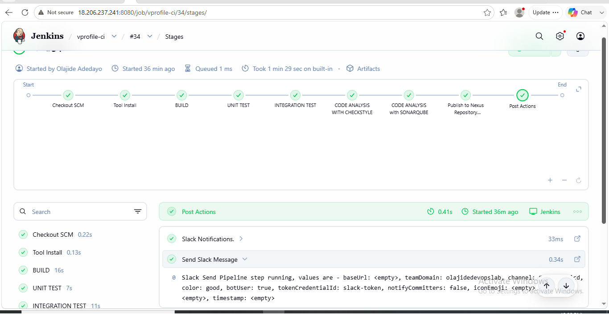
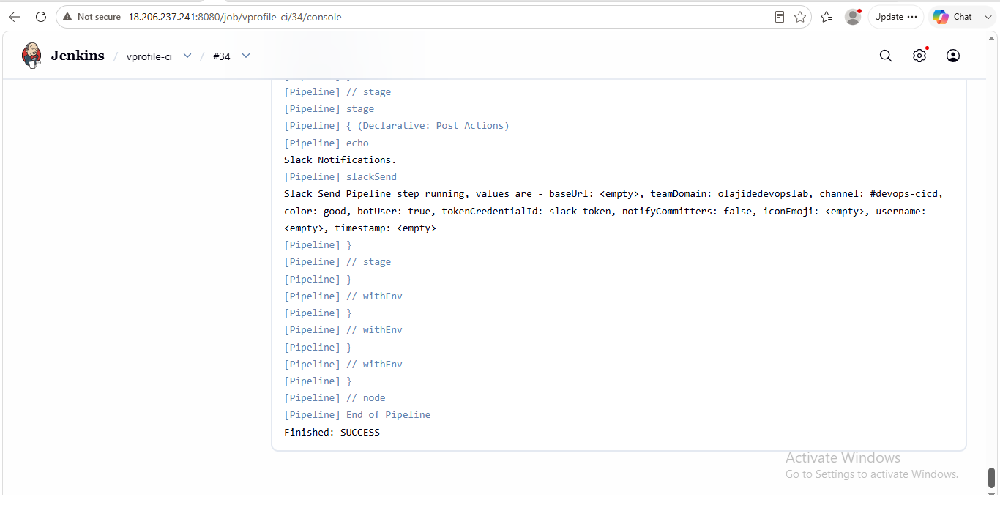
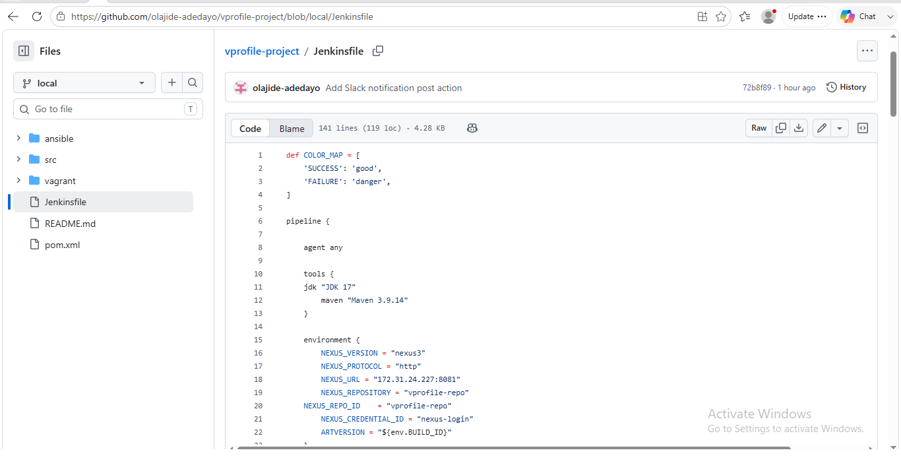
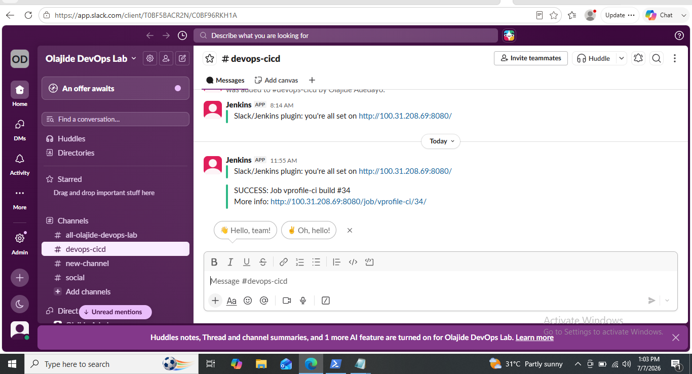
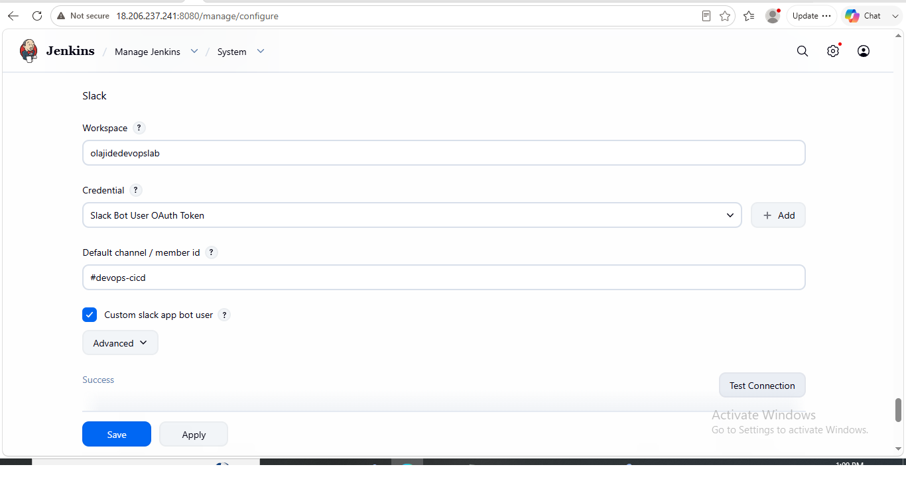

# 🚀 Enterprise Jenkins CI Pipeline – Slack Notification Integration on AWS

📖 Project Overview

This project demonstrates the integration of Slack notifications into an enterprise Jenkins Continuous Integration (CI) pipeline hosted on Amazon Web Services (AWS). The primary objective was to automate real-time build notifications, enabling development and DevOps teams to receive immediate feedback whenever a pipeline execution completes successfully or fails.

The implementation extends an existing CI pipeline for the VProfile Java application by integrating Jenkins with Slack through the Jenkins Slack Notification Plugin and a custom Slack App using Bot User OAuth authentication. Upon completion of each pipeline execution, Jenkins automatically sends a notification to a designated Slack channel containing the build status, job name, build number, and a direct link to the build for quick investigation.

The notification process is fully integrated into the CI workflow, which includes source code checkout from GitHub, application build with Apache Maven, unit testing, Checkstyle analysis, SonarQube code quality analysis, Quality Gate validation, artifact publication to Nexus Repository Manager, and automated Slack notifications.

This project demonstrates practical experience in integrating collaboration platforms with CI pipelines to improve team communication, build visibility, and operational efficiency while following enterprise DevOps best practices.

🎯 Business Objective

In modern software development, timely communication is essential for maintaining fast and reliable delivery pipelines. Relying on engineers to manually monitor Jenkins builds is inefficient and can delay the identification and resolution of build failures.

The objective of this project was to enhance an existing enterprise Continuous Integration (CI) pipeline by integrating Slack as a real-time notification platform. This enables Jenkins to automatically notify development and DevOps teams whenever a pipeline execution succeeds or fails, providing immediate visibility into build outcomes without requiring users to access the Jenkins dashboard.

By incorporating Slack notifications into the CI workflow, the solution improves collaboration, accelerates feedback loops, reduces response time to build issues, and increases operational transparency. This integration reflects a common enterprise DevOps practice, where CI/CD platforms are connected with team communication tools to support efficient software delivery and rapid incident response.

🏗️ Solution Architecture

The solution integrates Slack with an existing enterprise Jenkins Continuous Integration (CI) pipeline to provide automated, real-time build notifications. Following each pipeline execution, Jenkins sends a notification to a designated Slack channel, allowing the engineering team to monitor build outcomes without manually accessing the Jenkins dashboard.

The pipeline automates the complete CI workflow, including source code retrieval, application build, testing, static code analysis, quality gate validation, artifact publication, and team notification.

Architecture Flow

GitHub Repository
        │
        ▼
Jenkins Pipeline
        │
        ▼
Source Code Checkout
        │
        ▼
Maven Build
        │
        ▼
Unit Tests
        │
        ▼
Checkstyle Analysis
        │
        ▼
SonarQube Analysis
        │
        ▼
Quality Gate Validation
        │
        ▼
Publish Artifact to Nexus Repository
        │
        ▼
Slack Notification
        │
        ▼
#devops-cicd Slack Channel

Architecture Components

Component| Purpose
GitHub| Hosts the VProfile application source code and Jenkinsfile.
Jenkins| Orchestrates the Continuous Integration (CI) pipeline.
Maven| Builds, tests, and packages the Java application.
SonarQube| Performs static code analysis and enforces the Quality Gate.
Nexus Repository Manager| Stores versioned build artifacts for future deployments.
Slack| Receives automated build notifications from Jenkins

## 🛠️ Technology Stack

The following technologies and services were used to implement the Slack notification integration within the Enterprise Jenkins Continuous Integration (CI) pipeline.

| Technology | Purpose |
|------------|---------|
| Amazon EC2 | Hosted the Jenkins Controller, Maven Agent, SonarQube Server, and Nexus Repository Manager. |
| Jenkins 2.555.3 | Orchestrated the Continuous Integration (CI) pipeline and executed automated Slack notifications after each pipeline run. |
| Jenkins Pipeline (Pipeline as Code) | Defined the CI workflow using a declarative Jenkinsfile stored in GitHub. |
| Jenkins Slack Notification Plugin | Enabled Jenkins to send real-time build notifications to Slack. |
| Slack | Collaboration platform used to receive automated pipeline notifications. |
| Slack App (Bot User OAuth) | Authenticated Jenkins with Slack using a secure Bot User OAuth Token. |
| Git | Managed source code version control. |
| GitHub | Hosted the VProfile application source code, Jenkinsfile, and project documentation. |
| Apache Maven 3.9.14 | Built, tested, packaged, and prepared the application for deployment. |
| OpenJDK 17 | Java runtime used by the Jenkins build environment. |
| SonarQube Community Build | Performed static code analysis and enforced Quality Gates before artifact publication. |
| Nexus Repository OSS 3.83.1-01 | Stored and managed versioned application artifacts generated by the CI pipeline. |
| Amazon Linux 2023 | Operating system for the Jenkins Controller, Maven Agent, and Nexus Repository Server. |
| Ubuntu 24.04 LTS | Operating system hosting the SonarQube Server. |
| Nginx | Configured as a reverse proxy for the SonarQube web interface. |

☁️ AWS Infrastructure

The Slack notification integration was implemented within an enterprise Continuous Integration (CI) environment hosted on Amazon Web Services (AWS). The infrastructure consisted of four Amazon EC2 instances, each dedicated to a specific role within the CI pipeline.

EC2 Instance| Operating System| Instance Type| Purpose
"jenkins-server"| Amazon Linux 2023| t3.small| Hosted the Jenkins Controller and orchestrated the CI pipeline, including Slack notifications.
"maven-agent"| Amazon Linux 2023| t3.small| Executed Maven builds, unit tests, Checkstyle analysis, SonarScanner, and artifact deployment on behalf of Jenkins.
"Sonar-Server"| Ubuntu 24.04 LTS| t3.small| Hosted SonarQube Community Build for static code analysis and Quality Gate validation.
"nexus-server"| Amazon Linux 2023| t3.small| Hosted Nexus Repository Manager for storing versioned application artifacts.

Infrastructure Summary

- Cloud Provider: Amazon Web Services (AWS)
- Compute Service: Amazon EC2
- Total EC2 Instances: 4
- Networking: All instances deployed within the same Amazon VPC using private networking for secure inter-service communication.
- SSH Connectivity: Jenkins connected securely to the Maven Agent using SSH private key credentials managed within Jenkins.
- Additional AWS Services: Amazon VPC, Subnets, Internet Gateway, Route Tables, Security Groups, and EC2 Key Pairs

⚙️ Jenkins & Slack Configuration

The Slack notification integration was implemented by configuring Jenkins to communicate securely with Slack using the Jenkins Slack Notification Plugin and a custom Slack App with Bot User OAuth authentication.

Jenkins Configuration

Configuration| Value
Jenkins Job| "vprofile-ci"
Job Type| Pipeline
Pipeline Definition| Pipeline Script from SCM
Source Code Repository| GitHub
Branch| "local"
Pipeline File| "Jenkinsfile"
Build Agent| "maven-agent"
Build Trigger| Manual

Slack Configuration

Configuration| Value
Slack Workspace| "olajidedevopslab"
Slack Channel| "#devops-cicd"
Authentication| Bot User OAuth Token
Jenkins Credential Type| Secret Text
Jenkins Credential ID| "slack-token"
Slack Plugin| Jenkins Slack Notification Plugin
Custom Slack App Bot User| Enabled
Test Connection| Successful

The Slack Bot User OAuth Token was stored securely in Jenkins Credentials and referenced by the Slack plugin. After each pipeline execution, Jenkins automatically sent a notification containing the build status, job name, build number, and a direct link to the build details.

---

🔄 Pipeline Workflow

After integrating Slack notifications, the Jenkins CI pipeline executed the following workflow automatically:

GitHub Repository
        │
        ▼
Jenkins Pipeline
        │
        ▼
Checkout Source Code
        │
        ▼
Maven Build
        │
        ▼
Unit Tests
        │
        ▼
Checkstyle Analysis
        │
        ▼
SonarQube Analysis
        │
        ▼
Quality Gate Validation
        │
        ▼
Archive WAR Artifact
        │
        ▼
Publish Artifact to Nexus Repository
        │
        ▼
Send Slack Notification
        │
        ▼
Slack Channel (#devops-cicd)

The pipeline completed successfully and automatically delivered a SUCCESS notification to the configured Slack channel, providing immediate visibility into the build outcome for the engineering team.

💻 Jenkinsfile Implementation

The Slack notification capability was implemented by extending the existing declarative Jenkins Pipeline. A color mapping was defined to display successful builds in green and failed builds in red within Slack.

A global "post" block was added to the pipeline so that Jenkins automatically sends a notification after every pipeline execution, regardless of the build result.

Slack Notification Logic

def COLOR_MAP = [
    'SUCCESS': 'good',
    'FAILURE': 'danger',
]

post {
    always {
        echo 'Slack Notifications.'

        slackSend(
            channel: '#devops-cicd',
            color: COLOR_MAP[currentBuild.currentResult],
            message: "${currentBuild.currentResult}: Job ${env.JOB_NAME} build #${env.BUILD_NUMBER}\nMore info: ${env.BUILD_URL}"
        )
    }
}

The notification includes:

- Build status (SUCCESS or FAILURE)
- Jenkins job name
- Build number
- Direct link to the Jenkins build

This implementation enables team members to access build information directly from Slack without manually logging into Jenkins.

---

🚀 Implementation Summary

The Slack notification integration was successfully incorporated into the existing Enterprise Jenkins Continuous Integration (CI) pipeline hosted on AWS.

The implementation involved:

- Installing and configuring the Jenkins Slack Notification Plugin.
- Creating a custom Slack App with Bot User OAuth authentication.
- Storing the Slack Bot OAuth Token securely in Jenkins Credentials.
- Configuring Slack Workspace and default notification channel.
- Updating the Jenkins Pipeline to include automated post-build Slack notifications.
- Migrating the pipeline to Pipeline Script from SCM using the Jenkinsfile stored in the GitHub repository.
- Validating Slack connectivity through Jenkins.
- Executing the complete CI pipeline and verifying successful notification delivery to Slack.

The completed solution provides automated, real-time build notifications, improving collaboration, visibility, and operational awareness across the software delivery process.

## 📸 Project Screenshots

The following screenshots provide visual evidence of the successful implementation of the Slack notification integration.

### 1. Jenkins Pipeline Overview

Complete Jenkins pipeline showing all stages executed successfully.

---

### 2. Jenkins Console Output

Jenkins Console Output confirming successful pipeline execution and Slack notification delivery.

---

### 3. Jenkinsfile (Pipeline as Code)

GitHub repository displaying the Jenkinsfile with the Slack notification implementation.

---

### 4. Slack Success Notification

Slack workspace (#devops-cicd) receiving an automated SUCCESS notification from the Jenkins pipeline.

---

### 5. Jenkins Slack Configuration

Jenkins Slack configuration showing the workspace, credentials, default channel, Custom Slack App Bot User enabled, and successful connection test.
